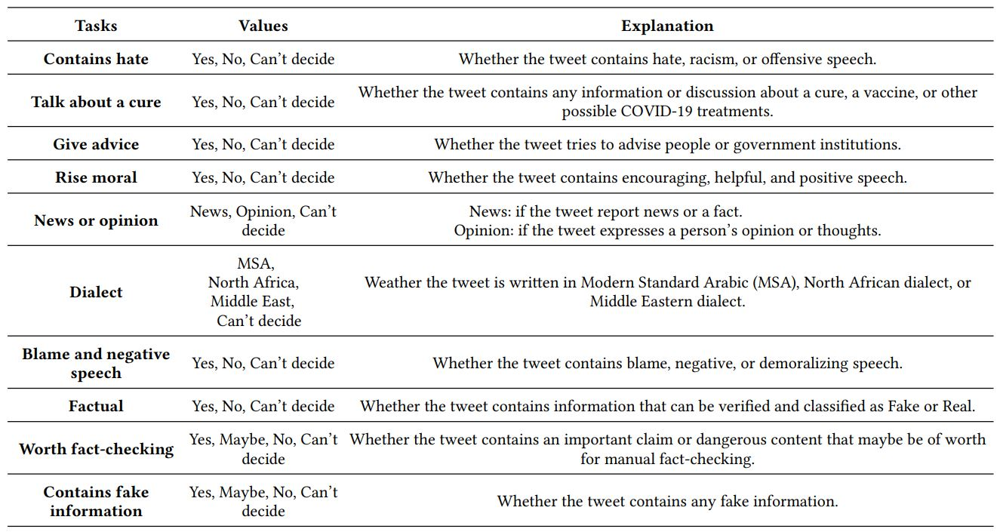

# ARACOVID19-MFH: Arabic COVID-19 Multi-label Fake news & Hate speech detection dataset

## Description

AraCOVID19-MFH is a manually annotated dataset containing 10,828 Arabic tweets annotated with 10 different labels. The lables that are used in the dataset are the following:



An example of the instances present in the dataset are provided in the below Table: 


## Statistics

The statistics the dataset are provided in the below Table: 


## Citations
If you want to use the dataset please cite the following arXiv paper:


```
@article{HADJAMEUR2021232,
title = {AraCOVID19-MFH: Arabic COVID-19 Multi-label Fake News & Hate Speech Detection Dataset},
journal = {Procedia Computer Science},
volume = {189},
pages = {232-241},
year = {2021},
note = {AI in Computational Linguistics},
issn = {1877-0509},
doi = {https://doi.org/10.1016/j.procs.2021.05.086},
url = {https://www.sciencedirect.com/science/article/pii/S1877050921012059},
author = {Mohamed Seghir {Hadj Ameur} and Hassina Aliane},
keywords = {Arabic COVID-19 Multi-label Dataset, Annotated Dataset, Fake News Detection, Hate Speech Detection, Misinformation, Social Media, Arabic Language},
abstract = {Along with the COVID-19 pandemic, an "infodemic" of false and misleading information has emerged and has complicated the COVID-19 response efforts. Social networking sites such as Facebook and Twitter have contributed largely to the spread of rumors, conspiracy theories, hate, xenophobia, racism, and prejudice. To combat the spread of fake news, researchers around the world have and are still making considerable efforts to build and share COVID-19 related research articles, models, and datasets. This paper releases "AraCOVID19-MFH"1 a manually annotated multi-label Arabic COVID-19 fake news and hate speech detection dataset. Our dataset contains 10,828 Arabic tweets annotated with 10 different labels. The labels have been designed to consider some aspects relevant to the fact-checking task, such as the tweet’s check worthiness, positivity/negativity, and factuality. To confirm our annotated dataset’s practical utility, we used it to train and evaluate several classification models and reported the obtained results. Though the dataset is mainly designed for fake news detection, it can also be used for hate speech detection, opinion/news classification, dialect identification, and many other tasks.}
}
```

## Contacts:
For all questions please contact ``mohamedhadjameur@gmail.com`` 

